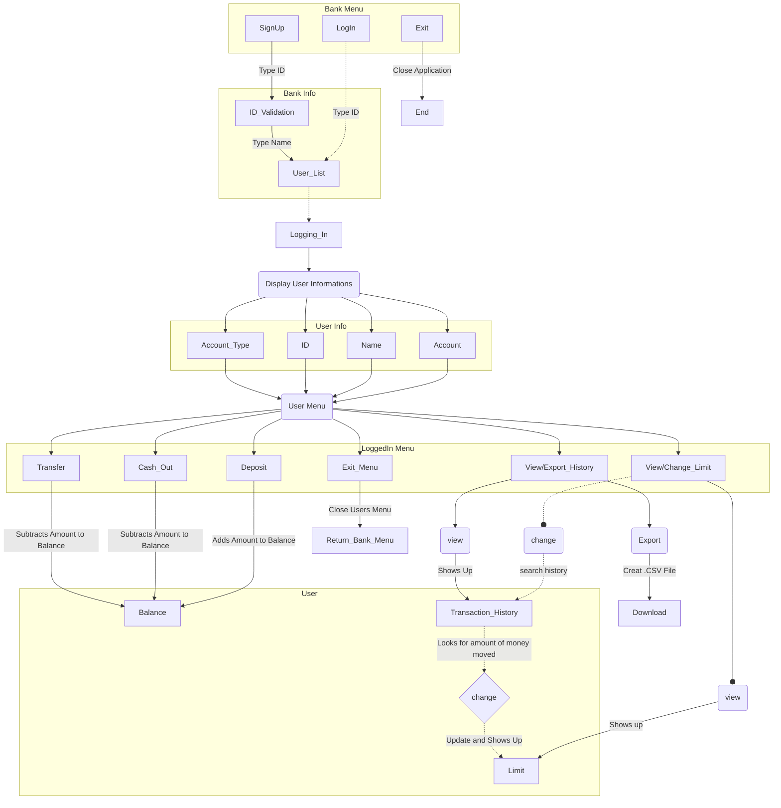

# bank-menu-challenge-training
 Just a model of a Bank App menu for interaction and transactions

############################################################################################################################

How to Use it:

First:
Choose one of the options in between: 
 -creating an account;
 -viewing your account;
 -exiting the app;
 
Second:
 If you choose to create it, then just put a Personal ID (it got to be 11 numbers);
 Than type your Name
 and then select the type of account you want to create:
  -Checking;
  -Salary;
  -Saving;

 Third:
  Now you will be back to the main menu, if you want to create a new account (recommend if you want to make transference's in between them)
if you don't, them just select to enter the application.
 In here you can choose different option:
  1- Make a deposit to it;
   Can be made with any value.
   
  2- Cash out;
   Can only be made if the value being taken out is not greater than the value the user has.
   
  3- Transfer;
   Can only be made if the value being taken out is not greater than the value the user has.
   
  4- View/Change Limit;
   Limit changes are made due to history in transactions and will be implemented by asking but the values are not decided by the user,
  the application will evaluate how much can you expand your limit using your transaction history.
  
  5 - View/Export Transaction History;
   Shows every transaction made since the account was created or create an .CSV file with all of it.
   
  6 - Exit the User Menu;
  ############################################################################################################################

OBSERVATIONS
 The code does not preserve anything, so once closed it will delete every information created.

############################################################################################################################

DIAGRAM 

